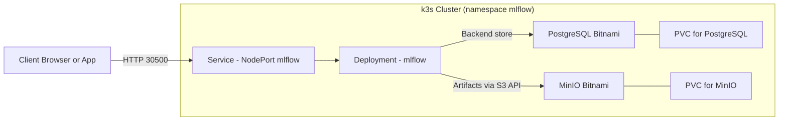

# MLflow on k3s with Helm (minimal production)

This chart deploys a small-footprint MLflow stack:
- PostgreSQL (Bitnami) as backend store
- MinIO (Bitnami) for artifacts (S3-compatible)
- MLflow Tracking Server exposed via NodePort

Optimized for your k3s cluster with NFS (nfs-client) StorageClass. You can switch to local-path if preferred.

## Prerequisites

- kubectl context to your k3s cluster
- Helm v3
- StorageClass available: nfs-client (recommended) or local-path

Namespace: mlflow

```sh
kubectl create namespace mlflow
```

## Install

From repo root:

```sh
# Add Bitnami repo for dependencies
helm repo add bitnami https://charts.bitnami.com/bitnami

# Go to the chart folder and pull dependencies
cd helm/mlflow-stack
helm dependency build

# Important: ensure .helmignore does NOT exclude the charts/ directory.

# Option A — Default (works): install pip packages at container start
helm install mlflow . -n mlflow --create-namespace \
  --set postgresql.primary.persistence.storageClass=nfs-client \
  --set minio.persistence.storageClass=nfs-client \
  --set mlflow.service.nodePort=30500
```

Option B — Custom MLflow image (production-friendly)
- Build an image that includes psycopg2-binary and boto3, then upgrade Helm to use it.
- Disable Option A’s startup pip step by setting installPipPackages to null.

```sh
# From repo root
docker build -t mlflow-with-drivers:0.1 -f docker/mlflow/Dockerfile .

# Use the custom image and disable startup pip (installPipPackages=null)
cd helm/mlflow-stack
helm upgrade mlflow . -n mlflow \
  --set mlflow.image=mlflow-with-drivers:0.1 \
  --set mlflow.installPipPackages=null
```

Notes for Option B:
- If you have multiple nodes, push the image to a registry or pre-pull on all nodes.
- If using a private registry, configure imagePullSecrets in the chart.

Access the UI:
- http://<any-node-ip>:30500
  - Examples from your nodes: http://192.168.1.91:30500, http://192.168.6.250:30500, http://192.168.1.38:30500

Verify:

```sh
kubectl -n mlflow get pods
kubectl -n mlflow get svc
kubectl -n mlflow rollout status deploy/mlflow-mlflow
```

In-cluster smoke test (Service reachability):

```sh
# Run a temporary curl pod and hit the MLflow Service from inside the cluster
kubectl -n mlflow run nettest --rm -it --image=curlimages/curl --restart=Never -- \
  sh -lc 'set -e; \
    echo "GET /"; curl -sS http://mlflow-mlflow.mlflow.svc.cluster.local:5000/ >/dev/null && echo "OK"; \
    echo "List experiments"; curl -sS http://mlflow-mlflow.mlflow.svc.cluster.local:5000/api/2.0/mlflow/experiments/list'
```

Get credentials and endpoints:

- PostgreSQL (set in values.yaml)
  - user: mlflow
  - password: mlflowpass
  - db: mlflow
  - host: mlflow-postgresql.mlflow.svc.cluster.local
- MinIO (set in values.yaml)
  - access key: mlflow
  - secret key: mlflowminio
  - S3 endpoint: http://mlflow-minio.mlflow.svc.cluster.local:9000
  - bucket: mlflow-artifacts
- MinIO console (optional, via port-forward):
```sh
kubectl -n mlflow port-forward svc/mlflow-minio 9000:9000 9001:9001
# S3 API: http://localhost:9000
# Console: http://localhost:9001  (login with mlflow / mlflowminio)
```

Quick client test:

```sh
export MLFLOW_TRACKING_URI=http://192.168.1.91:30500
python - <<'PY'
import mlflow, sklearn
from sklearn.linear_model import LinearRegression
from sklearn.datasets import make_regression
X, y = make_regression(n_samples=200, n_features=5, noise=0.1, random_state=42)
with mlflow.start_run(run_name="smoke-test"):
    model = LinearRegression().fit(X, y)
    mlflow.log_param("features", X.shape[1])
    mlflow.log_metric("score", model.score(X, y))
    mlflow.sklearn.log_model(model, "model")
print("OK")
PY
```

Set envs in your apps:

```sh
export MLFLOW_TRACKING_URI=http://192.168.1.91:30500
```

## Uninstall

```sh
helm uninstall mlflow -n mlflow
kubectl delete ns mlflow
```

## Notes

- Storage: defaults use nfs-client; switch to local-path via --set ...storageClass=local-path
- Small footprint: resources are modest; tune in values.yaml
- Single MLflow replica; safe with Postgres + MinIO
- If the MLflow image lacks psycopg2-binary/boto3, set mlflow.image to a custom image that includes them

## Architecture



## Repository layout

```
k8s-mlfow-demo/
├─ README.md
├─ LICENSE
├─ docs/
│  └─ architecture.mmd
├─ docker/
│  └─ mlflow/
│     └─ Dockerfile
└─ helm/
   └─ mlflow-stack/
      ├─ Chart.yaml
      ├─ values.yaml
      ├─ .helmignore
      ├─ charts/                # populated by `helm dependency build`
      └─ templates/
         ├─ deployment.yaml
         ├─ service.yaml
         ├─ secret.yaml
         └─ NOTES.txt
```

Summary:
- MLflow via NodePort (default 30500) on all nodes.
- PostgreSQL stores metadata; MinIO stores artifacts in bucket mlflow-artifacts.
- PVCs use nfs-client (switch to local-path if needed).

## Troubleshooting

- NodePort connection refused:
  - Check endpoints: kubectl -n mlflow get endpoints mlflow-mlflow
    - If empty, ensure pod is Ready and not OOMKilled: kubectl -n mlflow get pods -o wide
  - Test the node running the pod first (NODE column IP).
  - Ensure Service has externalTrafficPolicy: Cluster (default in this chart).
- OOMKilled:
  - Reduce workers and increase memory (defaults in values.yaml):
    --set mlflow.gunicornCmdArgs="--workers 1 --timeout 300" \
    --set mlflow.resources.requests.memory=512Mi \
    --set mlflow.resources.limits.memory=1Gi